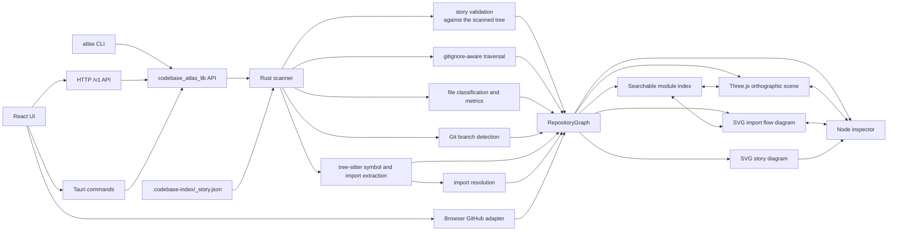
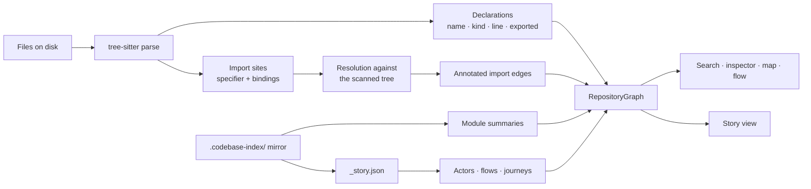
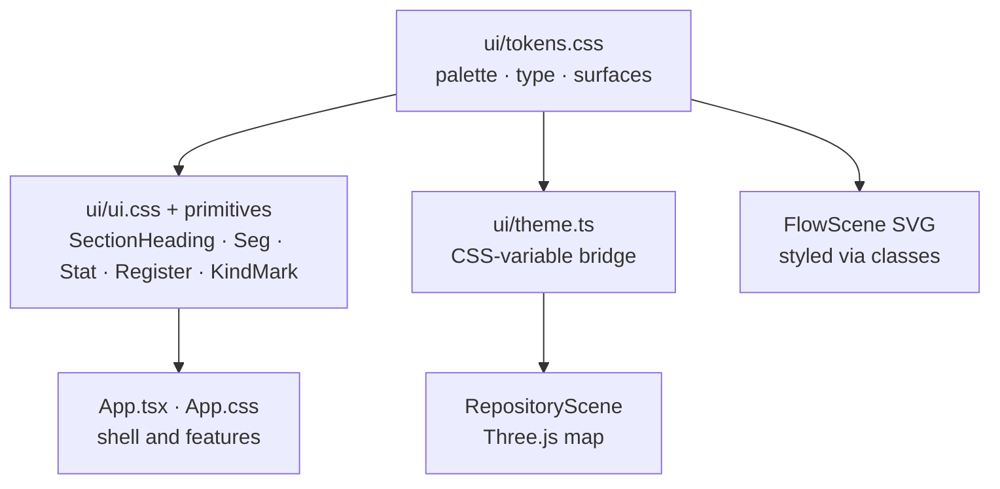
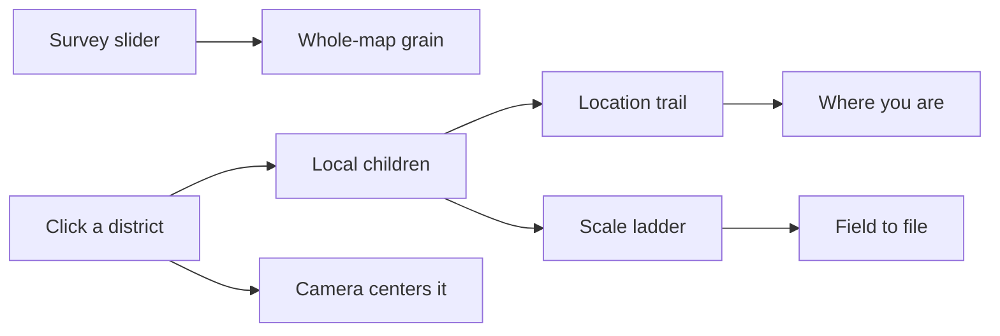

# Codebase Atlas

Codebase Atlas is a read-only repository graph engine with a Rust API, CLI, HTTP API, and interactive visualizer for local directories and public GitHub repositories. It opens on a plain-English story of how the code works — the parts a reader would recognize and what travels between them — and drills into two reference views over the same repository: an orthographic 3D field with searchable modules, language statistics, import flow arcs, layer controls, and a synchronized inspector, and an import-flow diagram.

The application runs as a web app, a Tauri 2 desktop app on macOS, Windows, and Linux, and a Tauri iOS app on iPhone and iPad. It uses React 19, TypeScript, and Three.js.

## Architecture



`codebase_atlas_lib` is the product boundary. Its public `scan` and `scan_json` functions produce the canonical serializable `RepositoryGraph`; the `atlas` CLI, `/v1` HTTP server, and Tauri commands are thin adapters over that API. The core/API/CLI is the default Cargo build and has no Tauri runtime dependency; Tauri enables the `app` feature for the desktop and mobile wrapper. React renders graphs and owns interaction state, but it does not scan local repositories. The browser-only GitHub adapter produces the same graph contract from GitHub's public repository and recursive Trees APIs. None of these sources send file contents into the scene.

## Design Decisions

- **Core-first adapters:** local repository analysis lives in the Rust library API. CLI, HTTP, and Tauri translate their input into that API and return its graph unchanged. This keeps agents, shell scripts, paired devices, and the desktop UI on one implementation instead of allowing the UI to become the product backend.
- **Companion over LAN or Tailscale:** the iPad app does not clone repositories. The desktop app (Share) or `atlas serve` listens on port 7420, advertises Wi-Fi and Tailscale addresses, and returns the same scan graph the desktop would draw. A pairing code gates catalog and scan; requested paths must sit under a folder the host has shared. HTTP on the tailnet is still encrypted by Tailscale; on local Wi-Fi the token is the access control. iPad connects with **Computer** — hostname.local, a LAN IP, or a Tailscale name / `100.x` address.
- **Native scanning:** Rust owns filesystem traversal so directory access remains outside the webview and behaves consistently across desktop platforms.
- **Native GitHub hierarchy:** the web source uses GitHub's repository and recursive Trees APIs rather than cloning repositories or proxying source through another server.
- **Source-control-aware traversal:** the `ignore` crate applies `.gitignore`, `.ignore`, global Git excludes, and common generated-directory exclusions. A hand-written ignore parser would be less correct.
- **Language-agnostic graph:** nodes and containment edges model structure consistently across mixed-language repositories.
- **Parsed import edges:** local scans parse each TypeScript, JavaScript, and Rust file with tree-sitter and read its import sites — `import`/`require`/dynamic `import()` forms, module-relative `new URL(path, import.meta.url)` dependencies, and `use` declarations — then resolve each specifier against the scanned tree: relative paths, workspace `package.json` names, and workspace crate names. Specifiers that do not resolve to a scanned file or directory (external packages, standard libraries) are dropped rather than guessed at, so every drawn edge points at real code. A real parse is what makes grouped and multi-line forms (`use crate::{a::B, c}`) resolve as precisely as the single-path form they abbreviate, and what lets `use super::*` inside a `mod tests` block name the file around it instead of inventing an edge to the crate root. This is deliberately still not a compiler: tsconfig path aliases, re-export chains, and dynamic module schemes are out of scope.
- **Edges carry what crosses them:** an import edge records the named bindings the importer takes — `App.tsx` does not merely import `model.ts`, it takes `RepositoryGraph`, `layerForNode`, and `formatBytes` from it. Bindings are read from the same parse, so they cost nothing beyond it and never drift from the code the way a written annotation would. Aliased bindings record the source name, since that is the symbol the target actually exports; namespace and glob imports record `*`; side-effect and dynamic imports record nothing, because nothing statically crosses.
- **Symbol index:** every parsed file carries the declarations it makes — functions, types, and constants, each with its line and whether it is exported. Language-specific declaration forms normalize to those three kinds, because finer distinctions do not survive a map legend, and a Rust `impl` block contributes its methods as `Type::method` so a type's real surface is visible. The index makes search find code rather than filenames, and gives the inspector a module's contents at the grain a reader actually asks about.
- **Aggregated flow rendering:** file-level import edges beyond the render cap lift to their nearest rendered ancestor and merge into weighted module-to-module arcs, so a large monorepo shows package-level flow instead of an unreadable hairball. Arcs shade from amber at the importer to rust at the imported module to show direction. At rest the map is a transit diagram: only the twelve heaviest routes stay on as arteries. Hovering or selecting a district reveals the streets that cross its boundary, keeps inner wiring at the mid base layer, and drops unrelated arteries to faint city context.
- **Flow view:** a second projection of the same graph where imports drive the layout instead of the directory tree. Modules become chips layered left to right by import direction — entry points that nothing imports on the left, shared foundations on the right — via longest-path layering over the condensation of strongly connected components, so import cycles share a column and render as dashed return edges rather than breaking the diagram. Selecting a chip traces its transitive upstream and downstream; barycenter ordering keeps edges short. The diagram is flat information, so it renders as plain SVG with CSS-animated pulses instead of another Three.js scene, and caps at 220 chips ranked by flow weight.
- **Flow stays detailed:** when the depth slider's level yields fewer than 12 flow modules, the flow view deepens on its own until the diagram says something, and labels the deeper level as "auto detail". The slider is a floor, not a ceiling. Hover tracing exists only on pointer devices; on touch (iPad), tapping a chip drives the same trace through selection.
- **Direct Three.js integration:** the scene uses Three.js without another rendering framework. React owns application state; Three.js owns the imperative scene lifecycle.
- **Deterministic layout:** sorted scan output and a stable layout produce the same map for the same repository state.
- **Position encodes containment:** the map is a nested squarified treemap — each directory is a district whose footprint contains its children, with area proportional to subtree code volume and alternating tones by nesting level. Hierarchy needs no drawn lines, so the only edges in the scene are import arcs. District name tags keep the field orientable: platforms whose children are rendered carry a floating paper region tag, unpacked leaf districts carry a tag on their slab, and tiny footprints stay untagged so labels never outnumber shapes. Tags look through wrapper directories (`src`, `lib`) and skip support directories (`test`, `fixtures`) the way flow chips do, so the field names real places instead of the same SRC/TEST pair on every plate. A tag is a handle on the place it names: hover or click one to select that district, even where it floats clear of its own footprint. Only the tag's ink takes the pointer, so the transparent margin around it never blocks the map behind.
- **Area is weighted code volume, not raw size:** source and documentation lines count in full, config and serialized data lines are quartered, and binary assets contribute only a small bounded presence weight — a folder of images or JSON exports cannot dominate the map. The inspector still reports exact raw bytes and lines.
- **A connection is inspectable in every view:** a story arc pins open to show what it carries, what comes back, and the files at each end; a map arc and a flow route both open the same panel listing the bindings that cross them, because a route means the same thing wherever it is drawn. Aggregation carries the union of crossing bindings up from the file-level edges it merges, bounded, because a route whose only label is its weight says two modules touch without saying why.
- **`.codebase-index/` is a shared convention, not one tool's directory:** the markdown mirror and `_story.json` sit there together with separate lifecycles. `.last-commit` tracks the mirror, which is regenerated per commit; it says nothing about the story, which is written once and validated against the scan directly. The staleness warning names the summaries it covers and stays quiet when no summary was attached, so a story is never tarred by a mirror that has drifted.
- **Codebase-index summaries:** when a repository carries a `.codebase-index/` markdown mirror, local scans attach each entry's leading summary to its node — the inspector shows what a module *is*, and search matches summary text, making queries semantic. The mirror itself stays out of the map, and a warning notes when the index is behind `HEAD`.
- **Facts and prose are separate layers:** the scanner produces facts — structure, metrics, import edges, crossing bindings, declarations — which are deterministic, cost a parse, and are exactly as current as the last scan. `.codebase-index/` produces prose, which describes intent no parse can recover but is written by a model and drifts from `HEAD`. Keeping them apart is why an arc's annotation can be trusted while a summary carries a staleness warning: nothing derivable is written down, and nothing written down is presented as derived.


- **Story view:** the landing view, and the only one written for a reader who has never opened a codebase. It draws a hand-authored `.codebase-index/_story.json`: actors with a plain-English blurb, the flows between them, and named journeys data takes end to end. It exists because the map and the flow view are both projections of the same two facts — containment and imports — and neither can express what a reader actually asks. The decisive gap is that the most important nodes in a data-flow story are not in the repository at all: the person typing, the chat service, the model being called. No parse can invent them, so the narrative is authored rather than derived, and a repository without the file gets an empty state explaining how to write one instead of a diagram derived from structure — which would only be the flow view with fewer chips.
- **Role is the layout:** a story file carries no coordinates. An actor's `role` — `person`, `surface`, `door`, `core`, `store`, `external` — is also its column, in that reading order, so naming an actor honestly places it. Empty roles collapse rather than leaving a gap. Return paths and same-stage links draw as dashed arcs, which is why a round trip needs no second row of boxes.
- **One arrow, both directions:** a flow records what it `carries` and, when anything comes back, what it `returns`. A journey step taken against a flow reads as its return text. Drawing one line per pair instead of two keeps a round-trip journey from doubling every arc on the diagram.
- **Sentences live in the caption, not on the arc:** a column gap is narrower than a sentence, so on-arc labels either truncate to nothing or paint over the next card. Hovering an arc or playing a journey puts the full text in one roomy caption bar at full size instead.
- **A journey brings the reader along:** the diagram is wider than the panel on any real repository, so playing a journey scrolls the current hop into view, lights it, keeps what it has already visited legible, and dims the rest. Width stops mattering when the view follows the data for you.
- **The story is validated against the scan:** actor ids, flow endpoints, journey steps, and module paths are all checked against the tree that was just scanned. What no longer resolves is dropped and reported as a scan warning, so a story that has drifted from the code still renders the part that is true — the expected failure of a hand-written file that outlives a rename.
- **Honest metrics:** local scans count lines from bounded text files. GitHub Trees provide file sizes but not contents, so GitHub maps encode size and mark line counts and import edges unavailable.
- **Bounded work:** scans stop at 4,000 nodes, the scene renders at most 700 nodes, local line counting skips files larger than 2 MiB, and the symbol index stops at 128 declarations per file and 60,000 overall so a generated surface cannot bloat a map that also travels to a paired device. Full scan statistics and the searchable index remain available when rendering is capped.
- **Event-driven rendering:** the scene redraws for camera or state changes instead of running a permanent animation loop.
- **In-repo design system:** the technical-manual olive/paper look lives in `src/ui/` as three layers — `tokens.css` (every color, surface, and type size as CSS custom properties, including the kind palette and the 3D map palette), `ui.css` plus small React primitives (`SectionHeading`, `Seg`, `Stat`, `Register`, `KindMark`) for markup patterns used across features, and `theme.ts`, which reads the tokens off the document so the Three.js scene and canvas labels follow the same palette. Restyling means editing tokens, not chasing literals; an external component library was rejected because the aesthetic is bespoke and the primitive count is small.



## CLI and HTTP API

Install the unified CLI from the checkout, then use `atlas` directly:

```bash
cargo install --locked --path src-tauri --bin atlas
atlas --help
atlas scan . > codebase-atlas.atlas.json
atlas scan --pretty --output map.atlas.json /path/to/repository
```

`atlas scan` writes only `RepositoryGraph` JSON to stdout. `--output` writes the same payload to a file. Usage errors exit 2, scan or I/O failures exit 1, and diagnostics go to stderr, so the command composes safely with shell pipelines and agent tooling.

`atlas serve` exposes the same scan API over HTTP for other machines and long-running agents:

```bash
# Terminal 1
atlas serve --token ATLAS234 /path/to/repository

# Terminal 2
curl http://127.0.0.1:7420/v1/health
curl -H 'Authorization: Bearer ATLAS234' http://127.0.0.1:7420/v1/catalog
curl -H 'Authorization: Bearer ATLAS234' \
  -H 'Content-Type: application/json' \
  --data '{"path":"/path/to/repository"}' \
  http://127.0.0.1:7420/v1/scan
```

The server writes one startup-status JSON object to stdout and human-readable addresses, pairing QR code, and diagnostics to stderr. `/v1/health` is public; `/v1/catalog` and `/v1/scan` require the bearer pairing code, and scan paths are restricted to the roots passed to `atlas serve`.

The library API is the same boundary for native callers:

```rust
let graph = codebase_atlas_lib::scan(std::path::Path::new("."))?;
let json = codebase_atlas_lib::scan_json(std::path::Path::new("."), false)?;
```

## Interaction

- Select **Scan directory** on the desktop to choose a repository.
- Select **Share** on the desktop to accept connections from this Wi-Fi or Tailscale network. The dialog shows a QR code, pairing code, and reachable addresses. Folders you scan are shared automatically; **Share folder** adds another root (a parent like `~/dev` lists the projects inside it).
- Select **Computer** on iPhone or iPad (or in the browser). The fastest path is to scan the QR code from the computer’s Share dialog — iOS Camera, or **Scan pairing code** inside the app. The catalog is the computer’s shared folders; choosing one runs the scan on the computer and draws the full-fidelity map here.
- Headless equivalent: `cargo run --manifest-path src-tauri/Cargo.toml --bin atlas -- serve /path/to/repo`.
- Select **GitHub URL** and enter a public repository URL in either the web or desktop app.
- Select **Save map** to export the current graph as a `.atlas.json` file, and **Open map** anywhere to load one. A map exported from a desktop scan carries everything the scan saw — annotated import edges, declarations, line counts, and codebase-index summaries — so a snapshot can still travel by AirDrop when the computer is offline.
- A map placed at `public/maps/default.atlas.json` is bundled into the build and loads automatically when no other source is saved — generate one headlessly with `cargo run --manifest-path src-tauri/Cargo.toml --bin atlas -- scan --output public/maps/default.atlas.json <repository>`. Bundled maps are snapshots (rebuild to refresh) and stay out of git.
- Drag to orbit, secondary-drag to pan, and scroll to zoom.
- Hover a module on the map to read its name and, when a `.codebase-index` summary exists, what it is — without leaving the field. Clicking an import arc opens what crosses it — the same route panel the flow view uses. Selecting a module centers it and lights its connections at the current survey grain without changing the current zoom or opening it; clicking the selection again decomposes it into its children. Selecting anything outside the opened district closes it, as do `Esc` and the ✕ close button in the toolbar — one district decomposed at a time. Map and flow share the selection, so flow traces the nearest chip and returning to the map keeps that place selected and centered. The inspector lists what the module contains, what it declares, what it imports, and what imports it — each import partner named alongside the bindings that actually cross to it. Press `0` or Reset to return to the survey view.
- Open a district on the map to show its children inside its footprint without moving the survey slider or changing the current zoom. Large districts also unpack on their own: a roomy tile shows its nested modules as a treemap under its name tag. The rest of the map stays at the survey grain. The header trail is the path you opened; the scale ladder names the grain (field, district, folder, file). Function is the next rung and is not in this survey yet. Click a trail crumb or an earlier scale rung to step back out.


- Toggle structure, source, config, documentation, tests, and import layers independently. The tests layer — files matching `*.test.*`/`*.spec.*`/`*_test.*` and everything under support directories like `test/` and `fixtures/` — starts hidden so the map leads with the product code; its toggle brings it back.
- Switch between **story**, **map**, and **flow** above the scene. Story opens first: a plain-English account of what the repository is, the parts a reader would recognize laid out left to right from the people who use it to the outside services it calls, and named journeys that follow one piece of data all the way through. Play a journey to watch it hop, one sentence at a time, with the diagram scrolling to keep up; hover any arrow to read what travels along it and what comes back, or click it to keep that open while you read both ends, each listed as files you can open; click a part to keep it lit while you read around it. Each part lists the files it is made of, and each of those opens on the map on its own — an actor is a role, so opening one arbitrary file for the whole card would misrepresent what it is. Story needs a `.codebase-index/_story.json`; without one the view says so and explains how to write it. Flow lays the same modules out by import direction — animated pulses run along each edge from importer to imported, line weight encodes import count, and chip size scales with the module. Large chips fill their extra area with a nested treemap of what they contain (click a cell to inspect that child) instead of a description; cells look through wrapper directories like `src` and `lib` to name the module's actual parts, and support directories (`test`, `fixtures`) render muted so the functional cells carry the chip. Selecting a chip (click or tap) dims everything except its transitive upstream and downstream. Clicking a route opens what crosses it — the union of bindings from every file-level import the route merges, which is what makes an aggregated arc mean something more than "these two touch". Flow needs import edges, so it asks for a local scan or an exported map when the source is GitHub.
- Drag the survey slider to set how many directory levels both views render by default (default 2; the top stop shows all). Import edges aggregate to the visible level, so a coarse survey shows package-to-package flow. Opening a district does not move the slider.
- Drag the module or inspector dividers to resize the side panels. Double-click a divider to restore its default width. The chosen widths persist for the next launch.
- Search (`/`) matches a module's name, path, language, `.codebase-index` summary, and the names it declares, so typing a function name finds the file that defines it and the files that take it.
- Press `G` to load GitHub, `C` to share (desktop) or connect to a computer (iPad / browser), `/` to search, `0` to reset the camera, and `+` or `-` to zoom.
- The last successful local or GitHub source is rescanned at the next launch.

## Writing a story

The story view reads `.codebase-index/_story.json`. It is written by hand (or by an agent that maintains the index), not derived, because the parts that matter most to a reader — the person typing, the chat service, the model being called — are not files in the repository.

```json
{
  "summary": "One paragraph a non-programmer can read.",
  "actors": [
    { "id": "person", "name": "Someone in Discord", "role": "person",
      "blurb": "Anyone chatting with Clankie in a server or a DM." },
    { "id": "front-door", "name": "The front door", "role": "door",
      "blurb": "Every request lands here first. It checks who is calling.",
      "modules": ["apps/clankie/src/app.ts", "packages/api-client"] }
  ],
  "flows": [
    { "from": "person", "to": "front-door",
      "carries": "a message someone typed",
      "returns": "his reply, posted back in the same place" }
  ],
  "journeys": [
    { "name": "Someone asks a question",
      "blurb": "The ordinary path.",
      "steps": ["person", "front-door", "person"] }
  ]
}
```

- `role` is also the column, in the order `person`, `surface`, `door`, `core`, `store`, `external`. There are no coordinates: name the role honestly and the layout follows.
- `modules` are paths as the scan sees them. An actor is a role, not a directory — several modules can serve one, and people and outside services have none.
- `carries` and `returns` are sentences, not type names. One arrow carries both directions.
- `steps` are actor ids. Consecutive pairs need a flow in one direction or the other; a step taken against a flow reads as its `returns`.
- Everything is checked against the scanned tree. Unknown ids and stale paths are dropped and reported as scan warnings rather than failing the scan, so the story keeps rendering the part that is still true.

## Development

Install the current [Tauri prerequisites](https://v2.tauri.app/start/prerequisites/) for the host platform, then run:

```bash
pnpm install
pnpm dev
pnpm tauri dev
```

Verification commands:

```bash
pnpm build
pnpm test
cargo test --manifest-path src-tauri/Cargo.toml
cargo clippy --manifest-path src-tauri/Cargo.toml --all-targets --all-features -- -D warnings
pnpm tauri build -- --debug --no-bundle
```

The package manager is pnpm, pinned by `packageManager` in `package.json`. Tauri's
`beforeDevCommand` and `beforeBuildCommand` call it directly, so the desktop and iOS
builds use the same toolchain as the frontend. `pnpm-workspace.yaml` also holds pnpm's
settings — pnpm 11 no longer reads a `pnpm` field in `package.json` — and grants esbuild
permission to run its postinstall, which links Vite's platform binary. Without that grant
pnpm blocks every script, `pnpm test` included, not just the install.

## Project Layout

```text
src/
  App.tsx                 application state and accessible shell
  ui/                     design system: tokens.css, ui.css, theme.ts, primitives
  PanelResizeHandle.tsx   draggable panel dividers
  panelLayout.ts          side-panel width clamping and persistence
  RepositoryScene.tsx     Three.js lifecycle and interaction
  RoutePanel.tsx          what crosses one import route, shared by map and flow
  repositoryLayout.ts     deterministic module placement
  placeNames.ts           wrapper/support toponyms shared by map and flow
  flowLayout.ts           import-direction chip layout
  StoryScene.tsx          narrative diagram, hover, and journey playback
  storyLayout.ts          role-as-column placement and journey hops
  companion.ts            LAN / Tailscale companion client
  github-url.ts           GitHub URL validation
  github.ts               GitHub API and tree-to-graph adapter
  model.ts                frontend graph contract and formatting
src-tauri/src/
  lib.rs                  public scan API and feature boundary
  app.rs                  thin Tauri command and lifecycle adapter
  cli.rs                  unified, scriptable CLI adapter
  scanner.rs              traversal, classification, metrics, tests
  imports.rs              specifier resolution against the scanned tree
  symbols.rs              tree-sitter declaration and import extraction
  story.rs                story file parsing and validation against the scan
  companion.rs            authenticated /v1 HTTP adapter
  bin/atlas.rs             atlas scan / serve entry point
  bin/scan.rs             compatibility alias for atlas scan
  bin/serve.rs            compatibility alias for atlas serve
```

Repository access is read-only. Local scans read metadata and bounded text files to count lines. GitHub scans make two unauthenticated requests to `api.github.com` and support public repositories only.
