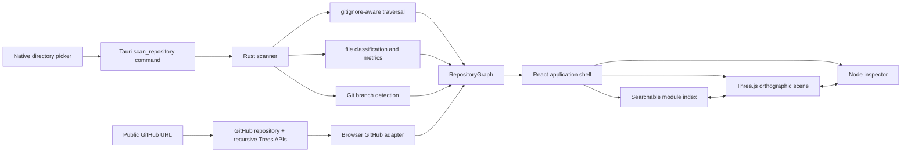

# Codebase Atlas

Codebase Atlas is a read-only visualizer for local directories and public GitHub repositories. It renders repository structure as an interactive orthographic 3D field with searchable modules, language statistics, layer controls, and a synchronized inspector.

The application runs as a web app and as a Tauri 2 desktop app on macOS, Windows, and Linux. It uses React 19, TypeScript, and Three.js.

## Architecture



Both source paths produce the same serializable `RepositoryGraph`. The native layer receives one local path; the browser adapter receives one public GitHub URL. Neither source sends file contents into the scene.

## Design Decisions

- **Native scanning:** Rust owns filesystem traversal so directory access remains outside the webview and behaves consistently across desktop platforms.
- **Native GitHub hierarchy:** the web source uses GitHub's repository and recursive Trees APIs rather than cloning repositories or proxying source through another server.
- **Source-control-aware traversal:** the `ignore` crate applies `.gitignore`, `.ignore`, global Git excludes, and common generated-directory exclusions. A hand-written ignore parser would be less correct.
- **Language-agnostic graph:** nodes and containment edges model structure consistently across mixed-language repositories. The data model does not infer semantic imports with language-specific regexes.
- **Direct Three.js integration:** the scene uses Three.js without another rendering framework. React owns application state; Three.js owns the imperative scene lifecycle.
- **Deterministic layout:** sorted scan output and a stable layout produce the same map for the same repository state.
- **Honest metrics:** local scans count lines from bounded text files. GitHub Trees provide file sizes but not contents, so GitHub maps encode size and mark line counts unavailable.
- **Bounded work:** scans stop at 4,000 nodes, the scene renders at most 700 nodes, and local line counting skips files larger than 2 MiB. Full scan statistics and the searchable index remain available when rendering is capped.
- **Event-driven rendering:** the scene redraws for camera or state changes instead of running a permanent animation loop.

## Interaction

- Select **Scan directory** to choose a repository.
- Select **GitHub URL** and enter a public repository URL in either the web or desktop app.
- Drag to orbit, secondary-drag to pan, and scroll to zoom.
- Select a module in the map or left index to inspect it.
- Toggle structure, source, config, and documentation layers independently.
- Press `G` to load GitHub, `/` to search, `0` to reset the camera, and `+` or `-` to zoom.
- The last successful local or GitHub source is rescanned at the next launch.

## Development

Install the current [Tauri prerequisites](https://v2.tauri.app/start/prerequisites/) for the host platform, then run:

```bash
npm install
npm run dev
npm run tauri dev
```

Verification commands:

```bash
npm run build
npm run test:github
cargo test --manifest-path src-tauri/Cargo.toml
cargo clippy --manifest-path src-tauri/Cargo.toml --all-targets -- -D warnings
npm run tauri build -- --debug --no-bundle
```

## Project Layout

```text
src/
  App.tsx                 application state and accessible shell
  RepositoryScene.tsx     Three.js lifecycle and interaction
  repositoryLayout.ts     deterministic module placement
  github-url.ts           GitHub URL validation
  github.ts               GitHub API and tree-to-graph adapter
  model.ts                frontend graph contract and formatting
src-tauri/src/
  lib.rs                  Tauri plugins and command registration
  scanner.rs              traversal, classification, metrics, tests
```

Repository access is read-only. Local scans read metadata and bounded text files to count lines. GitHub scans make two unauthenticated requests to `api.github.com` and support public repositories only.
