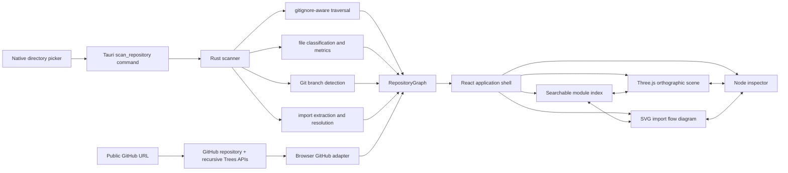
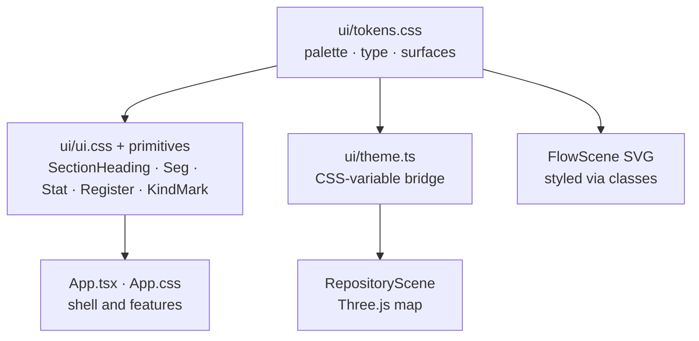
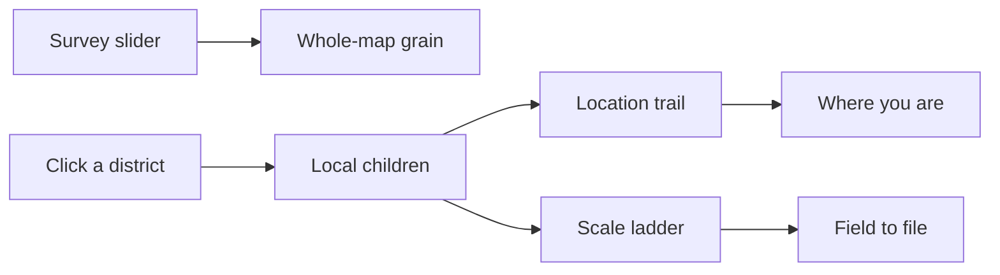

# Codebase Atlas

Codebase Atlas is a read-only visualizer for local directories and public GitHub repositories. It renders repository structure as an interactive orthographic 3D field with searchable modules, language statistics, import flow arcs, layer controls, and a synchronized inspector.

The application runs as a web app and as a Tauri 2 desktop app on macOS, Windows, and Linux. It uses React 19, TypeScript, and Three.js.

## Architecture



Both source paths produce the same serializable `RepositoryGraph`. The native layer receives one local path; the browser adapter receives one public GitHub URL. Neither source sends file contents into the scene.

## Design Decisions

- **Native scanning:** Rust owns filesystem traversal so directory access remains outside the webview and behaves consistently across desktop platforms.
- **Native GitHub hierarchy:** the web source uses GitHub's repository and recursive Trees APIs rather than cloning repositories or proxying source through another server.
- **Source-control-aware traversal:** the `ignore` crate applies `.gitignore`, `.ignore`, global Git excludes, and common generated-directory exclusions. A hand-written ignore parser would be less correct.
- **Language-agnostic graph:** nodes and containment edges model structure consistently across mixed-language repositories.
- **Heuristic import edges:** local scans extract `import`/`require` specifiers from TypeScript and JavaScript and `use` declarations from Rust with line-based parsing, then resolve them against the scanned tree — relative paths, workspace `package.json` names, and workspace crate names. Specifiers that do not resolve to a scanned file or directory (external packages, standard libraries, parser false positives) are dropped rather than guessed at, so every drawn edge points at real code. This is deliberately not a compiler: tsconfig path aliases, re-export chains, and dynamic module schemes are out of scope.
- **Aggregated flow rendering:** file-level import edges beyond the render cap lift to their nearest rendered ancestor and merge into weighted module-to-module arcs, so a large monorepo shows package-level flow instead of an unreadable hairball. Arcs fade from the importer toward the imported module to show direction.
- **Flow view:** a second projection of the same graph where imports drive the layout instead of the directory tree. Modules become chips layered left to right by import direction — entry points that nothing imports on the left, shared foundations on the right — via longest-path layering over the condensation of strongly connected components, so import cycles share a column and render as dashed return edges rather than breaking the diagram. Selecting a chip traces its transitive upstream and downstream; barycenter ordering keeps edges short. The diagram is flat information, so it renders as plain SVG with CSS-animated pulses instead of another Three.js scene, and caps at 220 chips ranked by flow weight.
- **Flow stays detailed:** when the depth slider's level yields fewer than 12 flow modules, the flow view deepens on its own until the diagram says something, and labels the deeper level as "auto detail". The slider is a floor, not a ceiling. Hover tracing exists only on pointer devices; on touch (iPad), tapping a chip drives the same trace through selection.
- **Direct Three.js integration:** the scene uses Three.js without another rendering framework. React owns application state; Three.js owns the imperative scene lifecycle.
- **Deterministic layout:** sorted scan output and a stable layout produce the same map for the same repository state.
- **Position encodes containment:** the map is a nested squarified treemap — each directory is a district whose footprint contains its children, with area proportional to subtree code volume and alternating tones by nesting level. Hierarchy needs no drawn lines, so the only edges in the scene are import arcs.
- **Area is weighted code volume, not raw size:** source and documentation lines count in full, config and serialized data lines are quartered, and binary assets contribute only a small bounded presence weight — a folder of images or JSON exports cannot dominate the map. The inspector still reports exact raw bytes and lines.
- **Codebase-index summaries:** when a repository carries a `.codebase-index/` markdown mirror, local scans attach each entry's leading summary to its node — the inspector shows what a module *is*, and search matches summary text, making queries semantic. The mirror itself stays out of the map, and a warning notes when the index is behind `HEAD`.
- **Honest metrics:** local scans count lines from bounded text files. GitHub Trees provide file sizes but not contents, so GitHub maps encode size and mark line counts and import edges unavailable.
- **Bounded work:** scans stop at 4,000 nodes, the scene renders at most 700 nodes, and local line counting skips files larger than 2 MiB. Full scan statistics and the searchable index remain available when rendering is capped.
- **Event-driven rendering:** the scene redraws for camera or state changes instead of running a permanent animation loop.
- **In-repo design system:** the technical-manual olive/paper look lives in `src/ui/` as three layers — `tokens.css` (every color, surface, and type size as CSS custom properties, including the kind palette and the 3D map palette), `ui.css` plus small React primitives (`SectionHeading`, `Seg`, `Stat`, `Register`, `KindMark`) for markup patterns used across features, and `theme.ts`, which reads the tokens off the document so the Three.js scene and canvas labels follow the same palette. Restyling means editing tokens, not chasing literals; an external component library was rejected because the aesthetic is bespoke and the primitive count is small.



## Interaction

- Select **Scan directory** to choose a repository.
- Select **GitHub URL** and enter a public repository URL in either the web or desktop app.
- Select **Save map** on the desktop to export the current graph as a `.atlas.json` file, and **Open map** anywhere to load one. A map exported from a desktop scan carries everything the scan saw — import edges, line counts, and codebase-index summaries — so private or local repositories can be viewed with full fidelity on devices that cannot scan them, such as the iOS app.
- A map placed at `public/maps/default.atlas.json` is bundled into the build and loads automatically when no other source is saved — generate one headlessly with `cargo run --manifest-path src-tauri/Cargo.toml --bin scan -- <repository> public/maps/default.atlas.json`. Bundled maps are snapshots (rebuild to refresh) and stay out of git.
- Drag to orbit, secondary-drag to pan, and scroll to zoom.
- Select a module in the map or left index to inspect it. The inspector shows its codebase-index summary when one exists, lists the modules it contains, and lists what it imports and what imports it; selecting a node highlights its flow arcs in the map.
- Click a district on the map to open it in place — its children appear inside its footprint without moving the survey slider. Large districts also unpack on their own: a roomy tile shows its nested modules as a treemap instead of a title. The rest of the map stays at the survey grain. The header trail is the path you opened; the scale ladder names the grain (field, district, folder, file). Function is the next rung and is not in this survey yet. Click a trail crumb or an earlier scale rung to step back out.


- Toggle structure, source, config, documentation, and import layers independently.
- Switch between **map** and **flow** above the scene. Flow lays the same modules out by import direction — animated pulses run along each edge from importer to imported, line weight encodes import count, and chip size scales with the module. Large chips fill their extra area with a nested treemap of what they contain (click a cell to inspect that child) instead of a description. Selecting a chip (click or tap) dims everything except its transitive upstream and downstream. Flow needs import edges, so it asks for a local scan or an exported map when the source is GitHub.
- Drag the survey slider to set how many directory levels both views render by default (default 2; the top stop shows all). Import edges aggregate to the visible level, so a coarse survey shows package-to-package flow. Opening a district does not move the slider.
- Drag the module or inspector dividers to resize the side panels. Double-click a divider to restore its default width. The chosen widths persist for the next launch.
- Press `G` to load GitHub, `/` to search, `0` to reset the camera, and `+` or `-` to zoom.
- The last successful local or GitHub source is rescanned at the next launch.

## Development

Install the current [Tauri prerequisites](https://v2.tauri.app/start/prerequisites/) for the host platform, then run:

```bash
npm install
npm run dev
npm run tauri dev
```

Verification commands:

```bash
npm run build
npm test
cargo test --manifest-path src-tauri/Cargo.toml
cargo clippy --manifest-path src-tauri/Cargo.toml --all-targets -- -D warnings
npm run tauri build -- --debug --no-bundle
```

## Project Layout

```text
src/
  App.tsx                 application state and accessible shell
  ui/                     design system: tokens.css, ui.css, theme.ts, primitives
  PanelResizeHandle.tsx   draggable panel dividers
  panelLayout.ts          side-panel width clamping and persistence
  RepositoryScene.tsx     Three.js lifecycle and interaction
  repositoryLayout.ts     deterministic module placement
  github-url.ts           GitHub URL validation
  github.ts               GitHub API and tree-to-graph adapter
  model.ts                frontend graph contract and formatting
src-tauri/src/
  lib.rs                  Tauri plugins and command registration
  scanner.rs              traversal, classification, metrics, tests
  imports.rs              import extraction and resolution
```

Repository access is read-only. Local scans read metadata and bounded text files to count lines. GitHub scans make two unauthenticated requests to `api.github.com` and support public repositories only.
