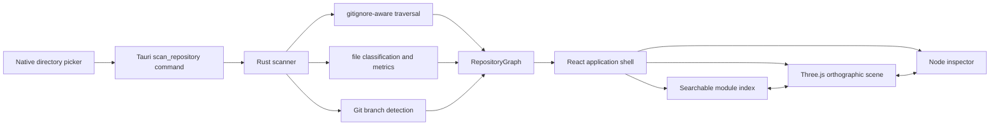

# Codebase Atlas

Codebase Atlas is a read-only desktop visualizer for local repositories. It scans a selected directory with native Rust code, then renders the repository as an interactive orthographic 3D field with searchable modules, language statistics, layer controls, and a synchronized inspector.

The application targets macOS, Windows, and Linux with Tauri 2, React 19, TypeScript, and Three.js.

## Architecture



The process boundary stays narrow: the native layer receives one path and returns one serializable `RepositoryGraph`. The webview never receives file contents and has no direct filesystem capability.

## Design Decisions

- **Native scanning:** Rust owns filesystem traversal so directory access remains outside the webview and behaves consistently across desktop platforms.
- **Source-control-aware traversal:** the `ignore` crate applies `.gitignore`, `.ignore`, global Git excludes, and common generated-directory exclusions. A hand-written ignore parser would be less correct.
- **Language-agnostic graph:** nodes and containment edges model structure consistently across mixed-language repositories. The data model does not infer semantic imports with language-specific regexes.
- **Direct Three.js integration:** the scene uses Three.js without another rendering framework. React owns application state; Three.js owns the imperative scene lifecycle.
- **Deterministic layout:** sorted scan output and a stable layout produce the same map for the same repository state.
- **Bounded work:** scans stop at 4,000 nodes, the scene renders at most 700 nodes, and line counting skips files larger than 2 MiB. Full scan statistics and the searchable index remain available when rendering is capped.
- **Event-driven rendering:** the scene redraws for camera or state changes instead of running a permanent animation loop.

## Interaction

- Select **Scan directory** to choose a repository.
- Drag to orbit, secondary-drag to pan, and scroll to zoom.
- Select a module in the map or left index to inspect it.
- Toggle structure, source, config, and documentation layers independently.
- Press `/` to search, `0` to reset the camera, and `+` or `-` to zoom.
- The last successful repository path is rescanned at the next launch.

## Development

Install the current [Tauri prerequisites](https://v2.tauri.app/start/prerequisites/) for the host platform, then run:

```bash
npm install
npm run tauri dev
```

Verification commands:

```bash
npm run build
cargo test --manifest-path src-tauri/Cargo.toml
cargo clippy --manifest-path src-tauri/Cargo.toml --all-targets -- -D warnings
npm run tauri build -- --debug --no-bundle
```

## Project Layout

```text
src/
  App.tsx                 application state and accessible shell
  RepositoryScene.tsx     Three.js lifecycle and interaction
  repositoryLayout.ts     deterministic module placement
  model.ts                frontend graph contract and formatting
src-tauri/src/
  lib.rs                  Tauri plugins and command registration
  scanner.rs              traversal, classification, metrics, tests
```

Repository access is read-only. The scanner reads metadata and bounded text files to count lines; it does not modify the selected codebase or send repository data over the network.
