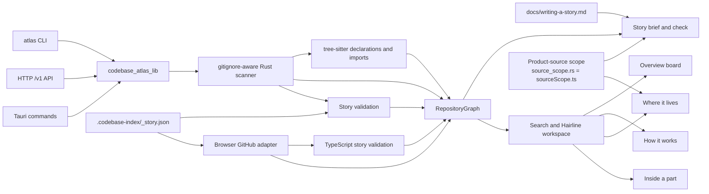
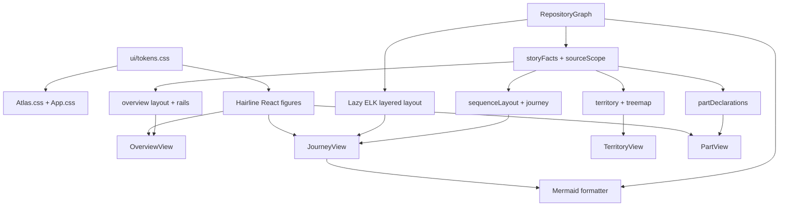

# Codebase Atlas

Codebase Atlas is a read-only repository graph engine with a Rust library, CLI, HTTP API, and interactive visualizer. It joins **facts read from code** — files, imports, names and declarations — with **prose written by hand** — parts, flows and journeys. Follow the data, locate its files, then look inside a part.

The React 19 + TypeScript interface runs on the web, Tauri 2 desktop (macOS, Windows and Linux), and Tauri iOS (iPhone and iPad). Its monochrome Hairline figures and Geist / Instrument Serif fonts are bundled for offline use (see [Credits](#credits)). Light/Dark follows the system until a device preference is saved.

## Architecture


```mermaid
flowchart LR
  CLI[atlas CLI] --> API[codebase_atlas_lib]
  HTTP[HTTP /v1 API] --> API
  Tauri[Tauri commands] --> API
  API --> Scanner[gitignore-aware Rust scanner]
  Scanner --> Parse[tree-sitter declarations and imports]
  Parse --> Graph[RepositoryGraph]
  Scanner --> Graph
  Rules[docs/writing-a-story.md] --> Brief
  Story[.codebase-index/_story.json] --> Validate[Story validation]
  Validate --> Graph
  Scanner --> Validate
  GH[Browser GitHub adapter] --> Web[TypeScript story validation]
  Story --> GH
  GH --> Graph
  Web --> Graph
  Graph --> Brief[Story brief and check]
  Graph --> UI[Search and Hairline workspace]
  Scope[Product-source scope<br/>source_scope.rs = sourceScope.ts] --> Brief
  Scope --> Territory
  UI --> Overview[Overview board]
  UI --> Journey[How it works]
  UI --> Territory[Where it lives]
  UI --> Part[Inside a part]
```

`codebase_atlas_lib` owns analysis. Its `scan` and `scan_json` functions produce the canonical `RepositoryGraph`; CLI, HTTP and Tauri are thin adapters. Core/API/CLI is the default Cargo build without a Tauri dependency; the native wrapper enables the `app` feature. The browser GitHub adapter produces the same contract using public repository and recursive Trees APIs plus one optional Contents request for a committed story. React renders the graph and owns interaction state. It does not scan the local filesystem.

## Design Decisions

- **One graph across adapters:** scripts, agents, paired devices and desktop use the same Rust implementation. The desktop Share dialog or `atlas serve` exposes it on port 7420 over LAN or Tailscale. A pairing code gates catalog and scans; paths must lie under shared roots. Mobile borrows the computer’s scan rather than cloning code.
- **Three flat screens replace the 3D map and import flow:** the earlier orthographic Three.js field and import-flow diagram were both projections of the same two scanned facts — containment and imports — and neither could answer what a reader asks: what travels where, and which files do that work. The workspace now separates **prose written by hand** (parts, flows, journeys) from **facts read from code** (files, lines, declarations, import crossings) and labels each. *How it works* follows the data along a written journey; *Where it lives* puts the selected part on a flat file territory, because depth on a 3D field encoded nothing a treemap's area does not; *Inside a part* shows the declarations and crossings that justify the prose. Three.js, the legacy design primitives and their camera controls were removed with the views.
- **Source-control-aware traversal:** the `ignore` crate handles `.gitignore`, `.ignore`, global excludes and common generated trees. Scan output is sorted and bounded at 4,000 nodes; line counting skips files over 2 MiB. Declaration indexing stops at 128 names per file and 60,000 overall.
- **Parsed facts:** tree-sitter reads TypeScript, JavaScript and Rust declarations and imports. Relative paths, workspace package/crate names, `new URL(path, import.meta.url)` and Rust `use` resolve against the scanned tree. Unresolved external packages are dropped. This is not a compiler: path aliases, re-export chains and dynamic module schemes remain out of scope.
- **Symbol index:** every parsed file carries the declarations it makes — functions, types and constants, each with its line and whether it is exported. Language-specific forms normalize to those three kinds, because finer distinctions do not survive a legend, and a Rust `impl` block contributes its methods as `Type::method` so a type's real surface is visible. Search and *Inside a part* both depend on this index: it makes search find code rather than filenames and gives a part its contents at the grain a reader asks about.
- **Crossing names:** edges record the bindings taken from each imported module. Aliases retain their source name, namespace/glob imports record `*`, and side-effect/dynamic imports carry no named bindings. The UI groups real edges at part boundaries; dependency direction is distinct from written data-flow direction.
- **Written story, scanned facts:** people, external systems and narrative exchanges cannot be inferred from imports. A hand-written `.codebase-index/_story.json` supplies actors, flows and journeys. Both validators drop invalid references and report warnings. The UI labels written, scanned and import-derived information separately.
- **Journey sequence by default:** How it works follows one journey, so one column per first-visited part and one row per hop make the order explicit. Repeated visits remain separate rows; dashed arrows carry return sentences. Hairline figures mark parts and a small dot marks people. Long sentences grow their rows; sticky headers and a card that grows to the journey up to 75vh keep long journeys readable, with a vertical exchange list on phones. Visited hops use ink, upcoming hops use `--graphic`, and the current 2px arrow carries a moving packet. Reduced motion stops packet animation and makes following scroll immediate. The stepper, part cards and scanned details share the selected step.
- **Flat territory:** a squarified treemap groups files by top-level area into tiles. Source/docs weight is full lines, config/data quarter weight, and binary assets contribute bounded presence. GitHub uses bytes as an estimate. Selected product files fill ink, other parts take the `--graphic` tone, uncovered files hatch, and tests/setup draw as outlined, transparent tiles. The legend lists only parts that own product files, then **Not in the story**; people and outside systems without files never produce empty 0% rows. A journey trace is a toggle button, not a checkbox; it marks each part's largest file and gives repeated visits to one part distinct, numbered stops. Small tiles remain available through full-size file-list controls. Area labels are derived, not written: an area reads as a part's name when that part owns at least 60% of its product lines, otherwise as "Several parts", "Tests", "Setup" or "Not in the story".
- **Honest coverage:** percentages use product-source lines, mirroring `source_scope.rs` in `sourceScope.ts`: tests/support, config, hidden tooling, vendored and generated trees are excluded, while stylesheets and markup (CSS, SCSS, HTML) count as source. `sourceScope.isTestPath` is the one TypeScript test rule (`model.ts`'s `isTestNode` delegates to it), and `tests/source-scope-table.json` is a path table that the TypeScript suite and a Rust unit test both assert, so the two sides cannot drift silently. The CLI needs only a covered total, so it takes the union of actor modules; the web needs a part per file, so ownership is exclusive — the most specific module wins and the earlier actor wins ties. Every file counts once either way, so the covered total is the same. GitHub shows file counts because lines/imports are unavailable; truncated scans are marked partial and gap suggestions are caveated. [The scope contract](docs/writing-a-story.md#product-source-scope-and-checks) records the precise exclusions.
- **Conservative gap hints:** walk uncovered product importers upstream, ignoring tests; an import of a directory stands for the files inside it. Suggest files only when all reached owning boundaries belong to one part and no unowned entry root exists. Cycles terminate; shared utilities and orphan cycles remain unassigned. Hints are facts to review, not automatic story edits.
- **Bounded file lists and declaration order:** Part file lists show the largest eight by scanned lines (bytes when line counts are unavailable), with a native **Show all N files** disclosure for the remainder. Inside a part applies the same cap to declaration file rows, support files and importing tests; crossing file lists and shared details use it too. Declarations remain exported first, then by line. It explicitly does not claim execution/call order. Tests are files that import the part; inline Rust tests do not become invented test files.
- **Overview is an isometric board with quarter turns, not a free 3D camera:** the main screen shows the whole codebase at once in the Hairline figures' own projection (azimuth 45°, k = 0.5, the 2:1 view). Each part that owns product source is a district, sized by product lines on a squarified treemap; small parts get a floored lot so every figure stands at one footprint and reads at one scale, so district area is proportional only above that floor. Files are pillars whose height is the square root of their lines, placed in path order along a snake through the block around a plaza for the figure. At most 360 pillars are drawn: each part shows its largest files and stacks the rest in one marked crate, which keeps Clankie (~1,000 product files) at about 1,300 SVG elements. People and outside services are small markers off the plate's edge, beside the parts they talk to. Rails are routed on a coarse grid along the two ground axes, cheap on streets, expensive through other districts, with a turn and reuse penalty, and they stop at plate edges. They aggregate product import edges (the `partCrossings` rules) and written flows. A free orbit camera was rejected for three reasons. The Hairline figures are fixed-angle drawings that would turn into misaligned sprites at arbitrary angles. Depth sorting for an orbit needs a real renderer, which the earlier Three.js field already showed encoded nothing extra. And the 2:1 view keeps ground labels and rails legible. Quarter turns ease the azimuth through the same projection (700 ms, Hairline's discrete clock), with the frame fitted to the union of all four poses so scale never jumps. Highlighting is a generated stylesheet over `data-part`/`data-pillar` attributes, so pointing re-renders only the overlay, never the memoized board. Figures stay upright sprites in an HTML layer above the SVG and do not rotate; plate names are painted last with a halo. Both are deliberate concessions to legibility over strict painter's order.
- **All parts uses ELK only on demand:** a secondary toggle exposes the whole network for orientation. ELK layered placement uses role partitions and orthogonal routing; a fixed seed and input order make the adapter deterministic. Its code loads when All parts opens, keeping the default sequence fast. The large network scrolls inside the card.
- **Hairline presentation:** shared light/dark tokens live in `ui/tokens.css`; React Hairline figures use those surfaces. People remain text, while other roles have documented figure defaults. Theme storage is guarded and system changes apply until a preference is saved; a `prefers-color-scheme` fallback in the tokens paints the right theme before React runs, so there is no light flash. The viewport allows pinch zoom (WCAG 1.4.4). Responsive layouts collapse the sidebar into top controls, reflow cards, and scroll the transit card internally on narrow screens.
- **Mermaid is an export, not the renderer:** Atlas needs selectable parts, playback, packet motion, scanned details and responsive scrolling. React renders those interactions; Mermaid provides portable story text for docs and chat. The TS formatter backs Copy as Mermaid and shares an exact-output fixture with Rust. The export carries a fixed light monochrome theme and safely encodes labels.
- **Repository access is read-only:** local scans read metadata and bounded text. GitHub fetches no source files or per-file summaries; a story read is capped at 256 KiB. Maps can travel as JSON snapshots and never execute the code they describe.


```mermaid
flowchart TD
  Tokens[ui/tokens.css] --> Shell[Atlas.css + App.css]
  Tokens --> Figures[Hairline React figures]
  Graph[RepositoryGraph] --> Facts[storyFacts + sourceScope]
  Facts --> Transit[sequenceLayout + journey]
  Facts --> Coverage[territory + treemap]
  Facts --> Declarations[partDeclarations]
  Facts --> Board[overview layout + rails]
  Board --> OverviewView
  Figures --> OverviewView
  Transit --> Journey[JourneyView]
  Graph --> Network[Lazy ELK layered layout]
  Network --> Journey
  Graph --> Export[Mermaid formatter]
  Journey --> Export
  Coverage --> Territory[TerritoryView]
  Declarations --> Part[PartView]
  Figures --> Journey
  Figures --> Part
```

## CLI and HTTP API

Install the unified CLI from the checkout, then use `atlas` directly:

```bash
cargo install --locked --path src-tauri --bin atlas
atlas --help
atlas scan . > codebase-atlas.atlas.json
atlas scan --pretty --output map.atlas.json /path/to/repository
atlas story brief /path/to/repository
atlas story check /path/to/repository
atlas story mermaid /path/to/repository > all-parts.mmd
atlas story mermaid /path/to/repository --journey "Someone opens a folder on their laptop" > journey.mmd
atlas story mermaid --journey 1 > first-journey.mmd
```

`atlas scan` writes only `RepositoryGraph` JSON to stdout. `--output` writes the same payload to a file. Usage errors exit 2, scan or I/O failures exit 1, and diagnostics go to stderr, so the command composes safely with shell pipelines and agent tooling.

`atlas story mermaid` reads and validates the story before exporting it. Without `--journey` it writes a `flowchart LR`, grouped in role subgraphs, with carries as edge labels. An exact journey name or **1-based index** writes a `sequenceDiagram`: actor names label participants, forward messages use `->>`, returns use `-->>` and the return sentence (or carries when no return is written). Names take precedence over numeric indices. Unknown journeys and unusable/warning-bearing stories fail with exit 1; malformed options exit 2. The default repository is `.`. Output goes only to stdout.

Exports include a Mermaid `base` theme init directive with white/card surfaces, ink text, hairline grey lines, Geist/system fonts and no mirrored sequence footer. This is a portable light monochrome theme even when Atlas is dark; the receiving renderer controls available fonts and Mermaid version. Labels use decimal Mermaid entities, generated participant IDs and normalized whitespace to prevent story text becoming diagram syntax or HTML. A shared special-character fixture checks exact TypeScript/Rust parity.

`atlas serve` exposes the same scan API over HTTP for other machines and long-running agents:

```bash
# Terminal 1
atlas serve --token ATLAS234 /path/to/repository

# Terminal 2
curl http://127.0.0.1:7420/v1/health
curl -H 'Authorization: Bearer ATLAS234' http://127.0.0.1:7420/v1/catalog
curl -H 'Authorization: Bearer ATLAS234' \
  -H 'Content-Type: application/json' \
  --data '{"path":"/path/to/repository"}' \
  http://127.0.0.1:7420/v1/scan
```

The server writes one startup-status JSON object to stdout and human-readable addresses, pairing QR code, and diagnostics to stderr. `/v1/health` is public; `/v1/catalog` and `/v1/scan` require the bearer pairing code, and scan paths are restricted to the roots passed to `atlas serve`.

The library API is the same boundary for native callers:

```rust
let graph = codebase_atlas_lib::scan(std::path::Path::new("."))?;
let json = codebase_atlas_lib::scan_json(std::path::Path::new("."), false)?;
```

## Interaction

- The **Source** menu retains **Scan directory** and **Share** on desktop, **Computer** for companion connections, **GitHub URL**, and **Open/Save map**. Share exposes pairing QR/code and reachable addresses. **Share folder** adds a root; scanned folders are shared automatically. Computer accepts a host/code or pairing QR. iOS Camera can open a paired deep link.
- **Overview** opens first: the whole codebase as an isometric board. Point at a district, figure or edge marker to ink its rails, fade unrelated parts, run packets along the rails and show up to nine crossing-name or written-flow labels; the corner read-out names the part, files, lines and connections. Point at a pillar to draw that file's imports along the ground axes; the stacked crate stands for a part's smaller files. Click (or Enter on the part chips below the board, whose focus shows the same highlight) to select a part and get **Inside a part**, **Where it lives** and **Follow** links for every journey it is on; the hatched lot opens the gap in Where it lives. ↺/↻ turn the board a quarter at a time; drag pans, pinch or Ctrl/⌘-scroll zooms, and −/+/Reset do the same from buttons. Reduced motion makes turns instant and holds packets still.
- **How it works** follows a journey as a sequence. Pick a written journey, use Prev/Play/Next or its ticks, and follow the carries/returns headline. Select a hop or participant header, or a part card, to inspect its exchanges, files and crossings. Dashed arrows are answers coming back. The sequence grows to fit up to 75vh, then scrolls inside its card, with the same cap on the vertical exchange list on phones. Use **All parts** to explore the role-grouped network and select connections. **Copy as Mermaid** exports the visible mode; blocked clipboard access reveals selectable text. **Look inside** opens the selected part.
- **Where it lives** highlights the selected part in a file treemap. The legend's whole-number percentages count product source for each part that owns files, then **Not in the story**, which selects the gap and its suggestions. Choose another part, press the trace toggle to follow a written journey across each part’s largest file, select a tile, or browse every file. People and outside systems without files are named outside the trace.
- **Inside a part** shows written Arrives/Leaves beside scanned files, declarations, crossings and importing tests. Choose a part from the part list (a disclosure, so long names wrap instead of truncating) or from its exchange and crossing links; a part without files shows only its written exchanges. Expand file rows to see their names and line numbers. File links take the selection to Where it lives.
- A missing story explains `atlas story brief` and `atlas story check`; Where it lives still shows the files. GitHub maps explicitly explain the lack of imports, declarations and line counts. Warnings remain visible.
- Search matches names, paths, languages, codebase-index summaries and declarations. Press `/` to focus search, `G` to open GitHub, `C` to Share (desktop) or Computer (mobile/browser), and `Esc` to close source/pairing dialogs or an open Source menu (focus returns to its button). Shortcuts ignore keys held with Cmd, Ctrl or Alt, so copy and other system chords pass through. Keyboard users can select exchange rows, participant headers, All parts routes and file tiles; tiny tiles have the accessible file list.
- Theme follows the system by default; Light/Dark remembers a preference on this device. The last successful local, GitHub or companion source reloads next launch.
- Save exports `.atlas.json` with scan facts and story. Open works anywhere. Put a snapshot at `public/maps/default.atlas.json` to bundle it for offline use; generate it with `cargo run --manifest-path src-tauri/Cargo.toml --bin atlas -- scan --output public/maps/default.atlas.json .`. Snapshots stay out of git and need regeneration to refresh.

## Writing a story

The [authoring rules and schema](docs/writing-a-story.md) are the single source embedded in `atlas story brief`. The web reads a committed story from the default branch; local scans read the same file from disk.

```bash
atlas story brief . > /tmp/atlas-story-brief.md
# Give the brief to your coding agent; it writes .codebase-index/_story.json.
atlas story check .
```

Actors may set an optional `figure` to a [Hairline figure name](docs/writing-a-story.md#part-figures). Unknown names warn and fall back. People use text; defaults are terminal (surface), padlock (door), riffle (core), cabinet (store), and branches (external).

The brief includes a compact scan digest, the existing story, and scan/validation warnings. The digest chooses the deepest uniform directory level that fits at most 150 modules, partitions only product code into rows without ancestor repeats, collapses single-child chains, summarizes docs/config on one line, lists up to six exported declarations per module, and aggregates at most 150 import routes with up to eight crossing names each. Display labels are bounded; omitted entries are counted. It supplies facts for an agent to investigate, not prose inferred from imports.

The check prints warnings to stderr and coverage to stdout. Coverage counts scanned product-source lines covered by the union of actor modules (a directory covers its descendants), following the [shared product-source scope](docs/writing-a-story.md#product-source-scope-and-checks): tests/support paths, hidden tooling, generated trees, lockfiles, config, and documentation are excluded. It lists uncovered files largest first, at most 150, and counts the rest. Coverage is informational: a valid story exits 0 even with uncovered code; story warnings, no usable story, or a scan failure such as a missing folder exit 1 (for `brief` too), and usage errors exit 2. Truncated scans and skipped line counts limit coverage to the available scan; other scan warnings are reported as information without invalidating the story.

## Development

Install the current [Tauri prerequisites](https://v2.tauri.app/start/prerequisites/) for the host platform, then run:

```bash
pnpm install
pnpm dev
pnpm tauri dev
```

Verification commands:

```bash
pnpm build
pnpm test
cargo test --manifest-path src-tauri/Cargo.toml
cargo clippy --manifest-path src-tauri/Cargo.toml --all-targets --all-features -- -D warnings
pnpm tauri build -- --debug --no-bundle
```

The package manager is pnpm, pinned by `packageManager` in `package.json`. Tauri's
`beforeDevCommand` and `beforeBuildCommand` call it directly, so the desktop and iOS
builds use the same toolchain as the frontend. `pnpm-workspace.yaml` also holds pnpm's
settings — pnpm 11 no longer reads a `pnpm` field in `package.json` — and grants esbuild
permission to run its postinstall, which links Vite's platform binary. Without that grant
pnpm blocks every script, `pnpm test` included, not just the install.

## Project Layout

```text
index.html                page head, theme-color and viewport
src/
  main.tsx                React entry; imports the self-hosted fonts
  App.tsx                 source lifecycle, dialogs, theme and screen navigation
  AtlasWorkspace.tsx      sidebar, search and shared part/journey state
  OverviewView.tsx        isometric board, figures, hover highlight, camera and selection
  overview.ts             iso projection, district/pillar layout, rail routing and labels
  JourneyView.tsx         journey playback, sequence, figures and exchanges
  TerritoryView.tsx       flat file map, journey trace and gap hints
  PartView.tsx            declarations, files, crossings and importing tests
  PartDetails.tsx         shared scanned file/crossing and written exchange lists
  storyFacts.ts           exclusive ownership, exchanges, crossings and tests
  sourceScope.ts          TS mirror of Rust product-source scope and isTestPath
  territory.ts            coverage, conservative gap derivation and map layout
  treemap.ts              weighted-volume and squarified packing utilities
  SequenceView.tsx        sticky participant columns, exchange rows and phone list
  sequenceLayout.ts       first-visit columns and rows sized to full sentences
  AllPartsView.tsx        lazy whole-network view and connection inspection
  elkLayout.ts            deterministic ELK layered/orthogonal adapter
  MermaidCopy.tsx         clipboard export with selectable-text fallback
  mermaid.ts              shared web formatter and safe label encoding
  journey.ts              journey hops, flow keys and label wrapping
  partDeclarations.ts     exported-first declaration ordering
  storyFigures.ts         figure catalogue and role defaults
  storyValidation.ts      web story validation against the mapped tree
  Atlas.css               responsive Hairline screen layouts
  App.css                 base styles, source/pairing dialogs and footer
  ui/                     tokens, PartFigure, theme and reduced-motion hooks
  companion.ts            LAN / Tailscale client
  PairingScanner.tsx      browser QR capture
  pairingQr.ts            pairing QR generation
  github-url.ts           GitHub URL validation
  github.ts               API and tree-to-graph adapter
  model.ts                graph contract, source classification and formatting
  vite-env.d.ts           Vite client type declarations
src-tauri/src/
  lib.rs                  public scan API and feature boundary
  main.rs                 desktop app entry point
  app.rs                  thin Tauri command and lifecycle adapter
  cli.rs                  unified, scriptable CLI adapter
  scanner.rs              traversal, classification, metrics, tests
  imports.rs              specifier resolution against the scanned tree
  symbols.rs              tree-sitter declaration and import extraction
  story.rs                story file parsing and validation against the scan
  story_authoring.rs      bounded authoring digest and coverage check
  mermaid.rs              validated story export and shared fixture test
  source_scope.rs         product-source exclusions shared by brief and coverage
  companion.rs            authenticated /v1 HTTP adapter
  bin/atlas.rs            atlas scan / serve / story entry point
  bin/scan.rs             compatibility alias for atlas scan
  bin/serve.rs            compatibility alias for atlas serve
tests/                    node:test suites, fixtures and source-scope-table.json
docs/
  writing-a-story.md      story schema and authoring rules embedded in the brief
```

## Credits

The part figures come from [`@lucasmarkes/hairline`](https://www.npmjs.com/package/@lucasmarkes/hairline) 0.3.0, MIT © Lucas Marques. Geist, Geist Mono and Instrument Serif are self-hosted through `@fontsource/geist`, `@fontsource/geist-mono` and `@fontsource/instrument-serif`, imported in `src/main.tsx`, under the SIL Open Font License 1.1.

All-parts layout uses [`elkjs`](https://github.com/kieler/elkjs) **0.12.0**, licensed here under **EPL-2.0**. It is loaded separately from the initial application bundle.
